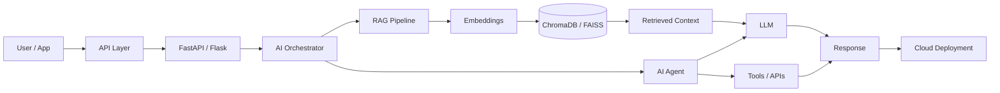
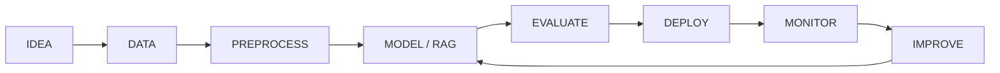

  

<!-- Animated role + technology logo carousel -->

---

## 🧠 NEURAL CORE — LIVE MODEL FLOW

 

### ◈ LIVE BUILD STREAM ◈

<table>
<tr>
<td align="center" width="33%">

</td>
<td align="center" width="33%">

</td>
<td align="center" width="33%">

</td>
</tr>
</table>

---

## 👋 About Me

---

## 🚀 Featured Work

<table>
<tr>
<td width="50%" valign="top">

### 🧠 AI Blueprint Agent
**RAG • Embeddings • Vector Search • Python**

Transforms raw requirements into structured project blueprints using retrieval-grounded generation.

<a href="https://github.com/CodeVersenet/AI-Blue-Print-Agent">↗ Open project</a>

</td>
<td width="50%" valign="top">

### 🧠 Neuro AI
**Enterprise AI • RAG • Knowledge Graphs • Agentic AI**

Industrial knowledge intelligence platform concept for unified enterprise knowledge and operational context.

<a href="https://github.com/CodeVersenet/Neuro-AI">↗ Open project</a>

</td>
</tr>
<tr>
<td width="50%" valign="top">

### 👁️ AlgoViz
**Python • Algorithms • Visualization**

Interactive code and algorithm visualizer for step-by-step execution and data-structure learning.

<a href="https://github.com/CodeVersenet/Algovis-Project">↗ Open project</a>

</td>
<td width="50%" valign="top">

### 🗺️ Dynamic Route Optimization AI
**Routing • Real-time data • Logistics**

Route-planning work covering fuel constraints, driver hours, traffic/weather inputs and dynamic rerouting.

<a href="https://github.com/CodeVersenet/Dynamic-Route-AI-">↗ Open project</a>

</td>
</tr>
<tr>
<td width="50%" valign="top">

### 🎵 BloomeeTunes
**Flutter • Rust • Music**

Open-source local and plugin-first music player project.

<a href="https://github.com/CodeVersenet/BloomeeTunes">↗ Open project</a>

</td>
<td width="50%" valign="top">

### 🧩 30 Days of DSA — Python
**Python • LeetCode • Algorithms**

Daily problem-solving journey covering arrays, strings, stacks, binary search, greedy techniques and more.

<a href="https://github.com/CodeVersenet/30DaysOfDSA-Python">↗ Open project</a>

</td>
</tr>
</table>

<b>＋ More projects</b>

 

### ⚙️ Byte Quest
AI application project built with a modern web stack and Gemini API integration.

<a href="https://github.com/CodeVersenet/Byte_Quest">↗ Open repository</a>

---

---

## 📊 GitHub Pulse

### 🟢 CONTRIBUTION MOTION

 

### ⚡ TECH STACK — FULL SYSTEM

<table>
<tr>
<td align="center" valign="middle" width="50%">

**LANGUAGES**

</td>
<td align="center" valign="middle" width="50%">

**AI / ML / GENAI**

</td>
</tr>
<tr>
<td align="center" valign="middle">

**BACKEND / API / FRONTEND**

 REST APIs

</td>
<td align="center" valign="middle">

**DATABASES / VECTOR SEARCH**

 ChromaDB • FAISS

</td>
</tr>
<tr>
<td align="center" valign="middle">

**CLOUD / DEVOPS**

 Vertex AI • CI/CD

</td>
<td align="center" valign="middle">

**TOOLS / PLATFORM**

</td>
</tr>
<tr>
<td align="center" valign="middle">

**AUTOMATION / TESTING**

 Rest-Assured

</td>
<td align="center" valign="middle">

**AI / AGENT TOOLING**

 Gemini • Agent Development Kit (ADK) • Vertex AI

</td>
</tr>
</table>

<b>Focus:</b> AI/ML • Generative AI • AI Agents • Backend Engineering • Cloud Engineering • Production Systems

### 🧠 AI NEURAL MOTION

 

### 🏗️ AI ARCHITECTURE

### 🔄 AI WORKFLOW

---

## 🧭 Engineering Playbook

<table>
<tr>
<td align="center">01 <b>UNDERSTAND</b></td>
<td>Define the real problem and constraints.</td>
</tr>
<tr>
<td align="center">02 <b>DESIGN</b></td>
<td>Choose architecture, data flow and interfaces.</td>
</tr>
<tr>
<td align="center">03 <b>BUILD</b></td>
<td>Implement the smallest useful system.</td>
</tr>
<tr>
<td align="center">04 <b>TEST</b></td>
<td>Validate behaviour and edge cases.</td>
</tr>
<tr>
<td align="center">05 <b>DEPLOY</b></td>
<td>Make the system usable and repeatable.</td>
</tr>
<tr>
<td align="center">06 <b>IMPROVE</b></td>
<td>Iterate using evidence and feedback.</td>
</tr>
</table>

---

## 🔭 Currently Exploring

**Advanced Python** • **DSA** • **LLM / RAG Systems** • **AI Agents** • **Backend Architecture** • **Cloud Engineering** • **Production AI**

---

## ⚡ Build Loop

**IDEA**
&nbsp;→&nbsp;
**DATA**
&nbsp;→&nbsp;
**MODEL**
&nbsp;→&nbsp;
**AGENT**
&nbsp;→&nbsp;
**API**
&nbsp;→&nbsp;
**CLOUD**
&nbsp;→&nbsp;
**IMPACT**

---

## 📫 Connect

<a href="https://praneshportfolio22.netlify.app"><b>Portfolio</b></a>
&nbsp; • &nbsp;
<a href="https://www.linkedin.com/in/pranesh22"><b>LinkedIn</b></a>
&nbsp; • &nbsp;
<a href="https://github.com/CodeVersenet"><b>GitHub</b></a>

  

### BUILD. LEARN. EXPERIMENT. SHIP.

Engineering intelligent systems one iteration at a time.

 

